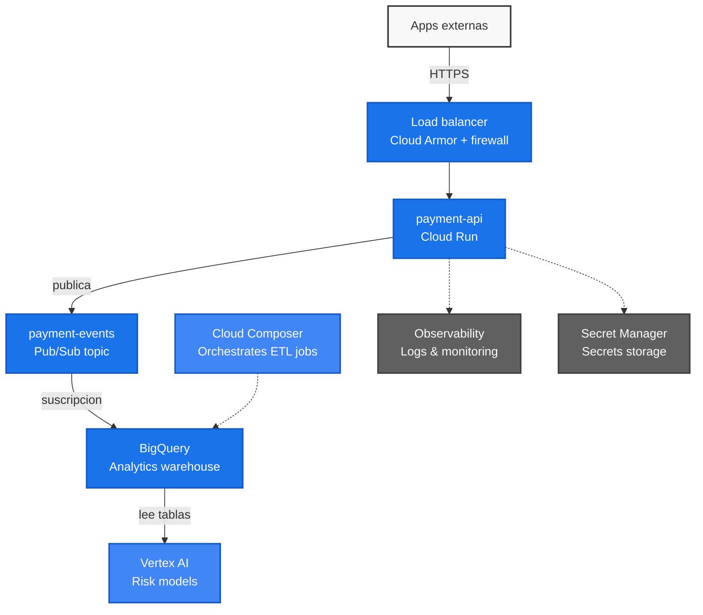

# Tenpo DevOps Challenge - payment-api

Este repositorio contiene la solución al desafío técnico para la posición de DevOps Senior GCP en Tenpo. La solución abarca desde el diseño de arquitectura y el aprovisionamiento de infraestructura mediante IaC (Terraform) hasta el despliegue continuo de un microservicio crítico de procesamiento de pagos (`payment-api`).

---

## Desafío 1: Diseño de la Solución

### Diagrama de Arquitectura End-to-End

El siguiente diagrama detalla el flujo de la arquitectura diseñada, abarcando desde la entrada de tráfico de red, el procesamiento en la API, la ingesta orientada a eventos hacia Pub/Sub y BigQuery, y finalmente la orquestación e ingesta para modelos de Machine Learning:

### 1. Decisiones de Arquitectura y lo que sacrificamos

#### Cómputo: payment-api sobre Cloud Run
Para levantar el servicio de la API, decidimos usar **Cloud Run**. Administrar clusters de Kubernetes (GKE) o gestionar máquinas virtuales (Compute Engine) para una sola API de pagos introduce una carga operativa enorme que no se justifica a esta escala. Cloud Run nos permite desentendernos por completo de parchar sistemas operativos, actualizar nodos y configurar reglas complejas de autoescalado. Además, escala a cero de forma automática, lo que resulta ideal para ahorrar costos en entornos no productivos (Desarrollo y QA) cuando no hay tráfico.

* **La desventaja:** El clásico retraso inicial (*cold start*), que es la latencia que ocurre al levantar una nueva instancia cuando el servicio ha escalado a cero por inactividad.
* **Mitigación:** En producción, mitigamos esto asegurando un mínimo de instancias activas (`min-instances = 1`). Esto anula el ahorro de costos del escalado a cero absoluto en prod, pero nos garantiza respuestas rápidas en todo momento para las transacciones. En desarrollo y QA sí permitimos el escalado a cero para optimizar el presupuesto.

#### Ingreso de Tráfico y Seguridad: Load Balancer + Cloud Armor
Para la entrada de tráfico público, evitamos exponer directamente la URL por defecto de Cloud Run. En su lugar, implementamos un **Load Balancer de Aplicación HTTPS** integrado con **Cloud Armor**. Esto nos da un punto de entrada único, terminación SSL/TLS segura y protección perimetral (WAF) contra ataques de denegación de servicio (DDoS) y vulnerabilidades comunes del OWASP Top 10.

* **El punto en contra:** Añade un costo fijo mensual debido al balanceador y a las políticas de Cloud Armor, además de agregar un componente extra en nuestro código de Terraform.
* **Justificación:** Al tratarse de un neobanco y un servicio financiero crítico que procesa pagos reales, la seguridad perimetral no es negociable. Exponer la API directamente a internet sin protección sería un riesgo inaceptable.

#### Procesamiento de Eventos: Pub/Sub
Elegimos **Pub/Sub** como nuestro bus de eventos para desacoplar el flujo de la transacción en tiempo real del análisis de datos posterior. En cuanto la API procesa el pago, publica el evento en el tópico `payment-events` y responde inmediatamente al cliente. Así, si los sistemas analíticos o de riesgo experimentan problemas o caídas, la transacción de pago principal no se ve afectada y los eventos quedan guardados de forma segura en la cola.

* **El costo de esta decisión:** Los sistemas orientados a eventos nos obligan a lidiar con la semántica de entrega *at-least-once* (al menos una vez).
* **Mitigación:** Esto requiere que los consumidores downstream (los servicios que procesen estos eventos más adelante) sean idempotentes, es decir, capaces de manejar el mismo evento varias veces sin duplicar operaciones.

#### Ingesta al Data Warehouse: Suscripción Directa de Pub/Sub a BigQuery
Para mover los datos de transacciones a **BigQuery**, optamos por la funcionalidad nativa de **Direct Subscription** de Pub/Sub. Históricamente, esto requería armar un pipeline intermedio en Cloud Dataflow o escribir una Cloud Function intermedia. 

* **La desventaja:** Perdemos flexibilidad para limpiar o transformar la carga útil (payload) del JSON antes de guardarla en la tabla.
* **Justificación:** Nos ahorramos mantener código de integración y eliminamos los costos de infraestructura asociados a tener un job de Dataflow corriendo 24/7. Las transformaciones complejas las podemos resolver directamente en BigQuery mediante vistas o procesos SQL batch posteriores.

#### Orquestación y Machine Learning: Cloud Composer + Vertex AI
Con los datos transaccionales almacenados en BigQuery, **Cloud Composer** (Airflow administrado) orquesta los flujos de trabajo batch periódicos (por ejemplo, cada noche). Estos flujos estructuran, limpian y agregan la información de pagos para alimentar los datasets y feature stores de **Vertex AI**, permitiendo entrenar y actualizar de forma constante los modelos de detección de fraude y evaluación de riesgo.

---

## Desafío 2: Infraestructura como Código (IaC)

*Próximamente: Archivos de Terraform y justificación de red privada.*

## Desafío 3: Despliegue de payment-api

*Próximamente: Código de la aplicación, pipeline de CI/CD y logs estructurados.*