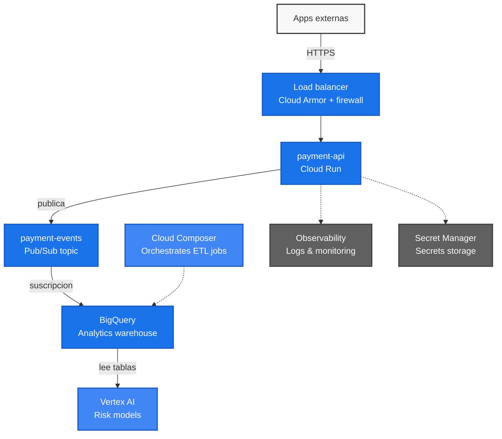

# Tenpo DevOps Challenge - payment-api

Este repositorio contiene la solución al desafío técnico para la posición de DevOps Senior GCP en Tenpo. La solución abarca desde el diseño de arquitectura y el aprovisionamiento de infraestructura mediante IaC (Terraform) hasta el despliegue continuo de un microservicio crítico de procesamiento de pagos (`payment-api`).

---

## Desafío 1: Diseño de la Solución

### Diagrama de Arquitectura End-to-End

El siguiente diagrama detalla el flujo de la arquitectura diseñada, abarcando desde la entrada de tráfico de red, el procesamiento en la API, la ingesta orientada a eventos hacia Pub/Sub y BigQuery, y finalmente la orquestación e ingesta para modelos de Machine Learning:



### 1. Decisiones de Arquitectura y lo que sacrificamos

#### Cómputo: payment-api sobre Cloud Run
Para levantar el servicio de la API, decidimos usar **Cloud Run**. Administrar clusters de Kubernetes (GKE) o gestionar máquinas virtuales (Compute Engine) para una sola API de pagos introduce una carga operativa enorme que no se justifica a esta escala. Cloud Run nos permite desentendernos por completo de parchar sistemas operativos, actualizar nodos y configurar reglas complejas de autoescalado. Además, escala a cero de forma automática, lo que resulta ideal para ahorrar costos en entornos no productivos (Desarrollo y QA) cuando no hay tráfico.

* **La desventaja:** El clásico retraso inicial (*cold start*), que es la latencia que ocurre al levantar una nueva instancia cuando el servicio ha escalado a cero por inactividad.
* **Mitigación:** En producción, mitigamos esto asegurando un mínimo de instancias activas (`min-instances = 1`). Esto anula el ahorro de costos del escalado a cero absoluto en prod, pero nos garantiza respuestas rápidas en todo momento para las transacciones. En desarrollo y QA sí permitimos el escalado a cero para optimizar el presupuesto.

#### Ingreso de Tráfico y Seguridad: Load Balancer + Cloud Armor
Para la entrada de tráfico público, evitamos exponer directamente la URL por defecto de Cloud Run. En su lugar, implementamos un **Load Balancer de Aplicación HTTPS** integrado con **Cloud Armor**. Esto nos da un punto de entrada único, terminación SSL/TLS segura y protección perimetral (WAF) contra ataques de denegación de servicio (DDoS) y vulnerabilidades comunes del OWASP Top 10.

* **El punto en contra:** Añade un costo fijo mensual debido al balanceador y a las políticas de Cloud Armor, además de agregar un componente extra en nuestro código de Terraform.
* **Justificación:** Al tratarse de un neobanco y un servicio financiero crítico que procesa pagos reales, la seguridad perimetral no es negociable. Exponer la API directamente a internet sin protección sería un riesgo inaceptable.

#### Procesamiento de Eventos: Pub/Sub
Elegimos **Pub/Sub** como nuestro bus de eventos para desacoplar el flujo de la transacción en tiempo real del análisis de datos posterior. In cuanto la API procesa el pago, publica el evento en el tópico `payment-events` y responde inmediatamente al cliente. Así, si los sistemas analíticos o de riesgo experimentan problemas o caídas, la transacción de pago principal no se ve afectada y los eventos quedan guardados de forma segura en la cola.

* **El costo de esta decisión:** Los sistemas orientados a eventos nos obligan a lidiar con la semántica de entrega *at-least-once* (al menos una vez).
* **Mitigación:** Esto requiere que los consumidores downstream (los servicios que procesen estos eventos más adelante) sean idempotentes, es decir, capaces de manejar el mismo evento varias veces sin duplicar operaciones.

#### Ingesta al Data Warehouse: Suscripción Directa de Pub/Sub a BigQuery
Para mover los datos de transacciones a **BigQuery**, optamos por la funcionalidad nativa de **Direct Subscription** de Pub/Sub. Históricamente, esto requería armar un pipeline intermedio en Cloud Dataflow o escribir una Cloud Function intermedia. 

* **La desventaja:** Perdemos flexibilidad para limpiar o transformar la carga útil (payload) del JSON antes de guardarla en la tabla.
* **Justificación:** Nos ahorramos mantener código de integración y eliminamos los costos de infraestructura asociados a tener un job de Dataflow corriendo 24/7. Las transformaciones complejas las podemos resolver directamente en BigQuery mediante vistas o procesos SQL batch posteriores.

#### Orquestación y Machine Learning: Cloud Composer + Vertex AI
Con los datos transaccionales almacenados en BigQuery, **Cloud Composer** (Airflow administrado) orquesta los flujos de trabajo batch periódicos (por ejemplo, cada noche). Estos flujos estructuran, limpiian y agregan la información de pagos para alimentar los datasets y feature stores de **Vertex AI**, permitiendo entrenar y actualizar de forma constante los modelos de detección de fraude y evaluación de riesgo.

---

## Desafío 2: Infraestructura como Código (IaC)

Toda la infraestructura está automatizada con **Terraform** bajo un diseño modular y desacoplado, pensado como una **plataforma reusable**. Esto establece el estándar para que otros squads del banco puedan desplegar nuevos microservicios de manera idéntica y segura.

### Estructura de Módulos
- **`modules/network`**: Crea una VPC dedicada, subredes totalmente privadas, un Cloud NAT para permitir salidas seguras a internet y un Serverless VPC Access Connector.
- **`modules/service`**: Despliega el microservicio en Cloud Run de forma 100% privada (bloqueando tráfico directo de internet y permitiendo solo el Load Balancer y la VPC). Además, provisiona su Service Account con el rol `logging.logWriter` e IAM de mínimo privilegio.
- **`modules/data_pipeline`**: Crea el tópico de Pub/Sub `payment-events`, el dataset/tabla en BigQuery y la suscripción directa entre ellos.

### Justificación de Seguridad y Red Privada
Para proteger el flujo transaccional y los datos de los usuarios:
* **Sin IPs Públicas**: Ninguno de los recursos internos del sistema tiene una IP pública direccionable.
* **Egreso Seguro (Cloud NAT)**: Si los servicios privados necesitan consumir APIs externas, el tráfico de salida se enruta a través de la VPC hacia el Cloud NAT, enmascarando las comunicaciones y protegiendo las identidades internas de la red.
* **Acceso Privado a APIs de Google**: La subred privada tiene habilitado `private_ip_google_access = true`. Esto permite que la API y otros recursos del VPC se comuniquen de forma privada con servicios administrados de Google (como Pub/Sub, BigQuery o Secret Manager) sin tocar internet.

---

### Preguntas del Desafío

#### 1. ¿Es tu diseño escalable? Justifica.
Sí, la arquitectura está pensada para escalar horizontalmente de forma automática y transparente en cada una de sus capas:

- **Cómputo (Cloud Run)**: Es completamente serverless y autoadministrado. Si la API recibe una ráfaga masiva de solicitudes de pagos, Cloud Run escala levantando nuevas instancias de contenedores en cuestión de segundos y las destruye cuando el tráfico disminuye, manejando picos de concurrencia sin intervención manual.
- **Buffer y Desacoplamiento (Pub/Sub)**: Actúa como amortiguador de tráfico. Si por algún motivo BigQuery o los consumidores downstream experimentan lentitud, Pub/Sub retiene los mensajes de forma duradera y persistente en cola, asegurando que no se pierda ninguna transacción y liberando inmediatamente a la API de pagos de esa espera.
- **Data Warehouse (BigQuery)**: El motor analítico de BigQuery es serverless. Separa el almacenamiento del cómputo y escala dinámicamente para procesar petabytes de datos en segundos. Al usar la suscripción directa de Pub/Sub, la escritura e ingesta masiva se manejan nativamente a escala por GCP.
- **Entrada (Load Balancer)**: El balanceador global de GCP distribuye la carga en la red de Google Edge, mitigando ataques de denegación de servicio (DDoS) a nivel de infraestructura antes de que lleguen a nuestro cómputo.

#### 2. ¿Qué tan acoplado está a GCP y qué implicaría migrar a otro provider?
El diseño lógico de la arquitectura es genérico y sigue patrones comunes de microservicios (API -> Bus de Eventos -> Data Warehouse -> Orquestador). Sin embargo, la implementación física en Terraform está fuertemente acoplada a las herramientas nativas de GCP para aprovechar al máximo el modelo serverless y reducir costos de mantenimiento.

Si tuviéramos que migrar a otro proveedor (por ejemplo, AWS o Azure), implicaría los siguientes cambios:

* **Infraestructura como Código (IaC)**: Habría que reescribir prácticamente todos los módulos de Terraform, ya que las llamadas a la API del proveedor, tipos de recursos y sintaxis son totalmente diferentes en AWS/Azure, aunque mantendríamos la lógica del pipeline de GitHub Actions en un 90%.
* **Reemplazo de Componentes**:
  - **Cloud Run** $\rightarrow$ Migraría a **AWS App Runner** o **Azure Container Apps**. Si buscamos portabilidad multicloud absoluta, tendríamos que adoptar Kubernetes (EKS/AKS), lo cual incrementaría fuertemente la complejidad operativa y costos.
  - **Pub/Sub** $\rightarrow$ Se reemplazaría por **AWS Kinesis / SQS** o **Azure Event Hubs / Service Bus**.
  - **BigQuery** $\rightarrow$ Se reemplazaría por **AWS Redshift** o **Azure Synapse**. (Perderíamos la funcionalidad nativa de Direct Subscription de Pub/Sub, por lo que tendríamos que agregar y mantener código intermedio, como un pipeline de AWS Lambda o Kinesis Firehose).
  - **Cloud Composer** $\rightarrow$ Migraría a **AWS MWAA** (Managed Workflows for Apache Airflow) o Azure Data Factory.

## Desafío 3: Despliegue de payment-api

El microservicio `payment-api` está desarrollado en **Python (Flask)** de forma simple y minimalista, optimizado para ejecutarse en Cloud Run de forma privada.

### Lógica del Servicio (`app/main.py`)
- **Endpoint `/payments` (POST)**: Recibe y procesa las solicitudes de pago. Valida que el payload contenga todos los campos mandatorios (`transaction_id`, `user_id`, `amount`, `currency`) y comprueba que el monto sea un valor numérico y mayor que cero.
- **Integración con Pub/Sub**: Si los datos son válidos, publica la transacción de inmediato en el tópico `tenpo-payment-events-dev` con estado `SUCCESS` y fecha en formato ISO 8601.
- **Health Check (`/` - GET)**: Endpoint básico de estado saludable para los chequeos de ciclo de vida de Google Cloud Run.

---

### Preguntas del Desafío

#### Una vez que el evento llega al topic, ¿qué necesitas construir para que aparezca en BigQuery?

**Nuestra Solución (Suscripción Directa)**
Para esta arquitectura, implementamos la **Suscripción Directa de Pub/Sub a BigQuery (Direct Subscription)** directamente desde Terraform. Gracias a esto, **no es necesario construir ningún desarrollo adicional** (como funciones intermedias o pipelines de datos). 

Los requerimientos de configuración fueron:
1. Crear el recurso `google_pubsub_subscription` y asociarlo a la tabla destino de BigQuery.
2. Otorgar permisos de escritura de datos (`roles/bigquery.dataEditor`) y lectura de esquema (`roles/bigquery.metadataViewer`) a la Service Account del servicio Pub/Sub (`service-PROJECT_NUMBER@gcp-sa-pubsub.iam.gserviceaccount.com`) sobre el dataset analítico.

**Otras alternativas (y por qué no las elegimos):**
* **Pipeline en Cloud Dataflow**: Requiere desplegar y mantener un pipeline (usualmente basado en plantillas Apache Beam de GCP). Es la mejor opción si necesitáramos hacer transformaciones avanzadas, limpiezas complejas o agregaciones en ventanas de tiempo *antes* de insertar los datos. No la elegimos porque añade sobrecarga de código, complejidad de monitoreo y costos fijos de servidores (Workers) innecesarios para esta carga.
* **Cloud Functions (Triggered por Pub/Sub)**: Una función serverless en Python que se activa en cada mensaje recibido y realiza inserciones en la tabla mediante el cliente SDK de BigQuery. Útil para lógica de enrutamiento dinámico simple. No la elegimos porque requiere programar, probar y mantener código de integración personalizado, mientras que la Suscripción Directa resuelve todo de forma 100% administrada e integrada por la nube.

---

### Logs Estructurados

La aplicación genera logs estructurados formateados en JSON y los escribe directamente en la salida estándar (`stdout`), permitiendo que **Google Cloud Logging** los capture, procese y filtre de manera nativa sin necesidad de agentes externos.

#### Ejemplo de Pago Exitoso (INFO)
```json
{
  "level": "INFO",
  "message": "Pago procesado exitosamente",
  "transaction_id": "tx-12345",
  "user_id": "usr-8877",
  "amount": 25000.0,
  "currency": "CLP",
  "status": "SUCCESS",
  "pubsub_message_id": "112233445566",
  "duration_ms": 12.4,
  "timestamp": "2026-08-08T20:15:00Z"
}
```

#### Ejemplo de Pago Fallido (ERROR)
```json
{
  "level": "ERROR",
  "message": "Fallo en el procesamiento de pago",
  "error_code": "INVALID_AMOUNT",
  "error_message": "El monto de la transaccion debe ser mayor a cero",
  "status": "FAILED",
  "duration_ms": 1.2,
  "timestamp": "2026-08-08T20:16:12Z",
  "transaction_id": "tx-54321"
}
```

---

### Ejemplos de Consumo (Pruebas Manuales)

#### Petición Exitosa (Status 201)
```bash
curl -X POST https://<LB-IP-O-DOMINIO>/payments \
  -H "Content-Type: application/json" \
  -d '{
    "transaction_id": "tx-9999",
    "user_id": "usr-5544",
    "amount": 150.50,
    "currency": "USD"
  }'
```
**Respuesta:**
```json
{
  "message": "Payment processed",
  "transaction_id": "tx-9999",
  "status": "SUCCESS"
}
```

#### Petición Inválida (Status 400 - Monto Negativo)
```bash
curl -X POST https://<LB-IP-O-DOMINIO>/payments \
  -H "Content-Type: application/json" \
  -d '{
    "transaction_id": "tx-9999",
    "user_id": "usr-5544",
    "amount": -50.00,
    "currency": "USD"
  }'
```
**Respuesta:**
```json
{
  "error": "Amount must be greater than zero"
}
```
